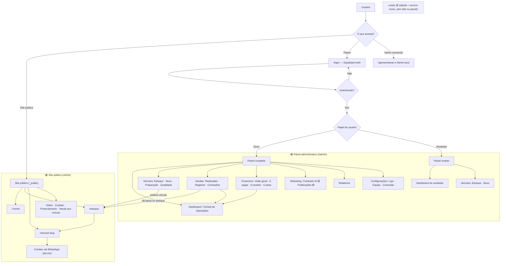
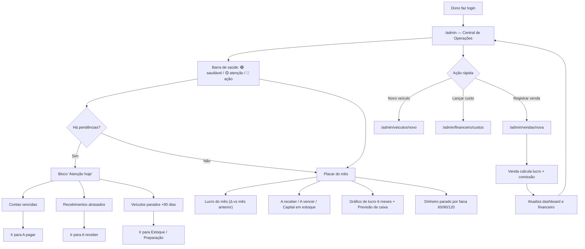
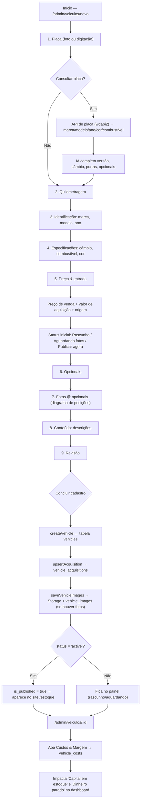
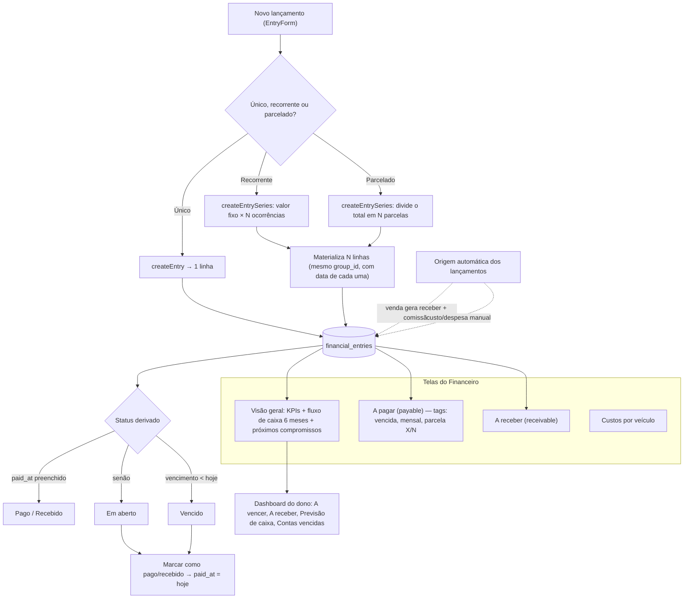
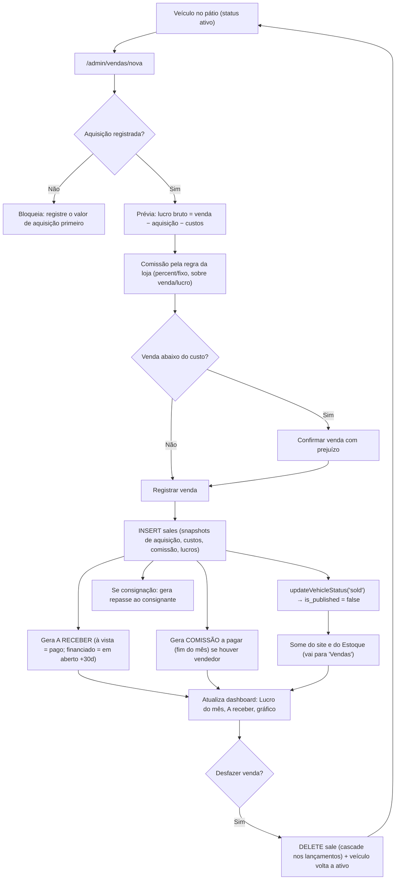
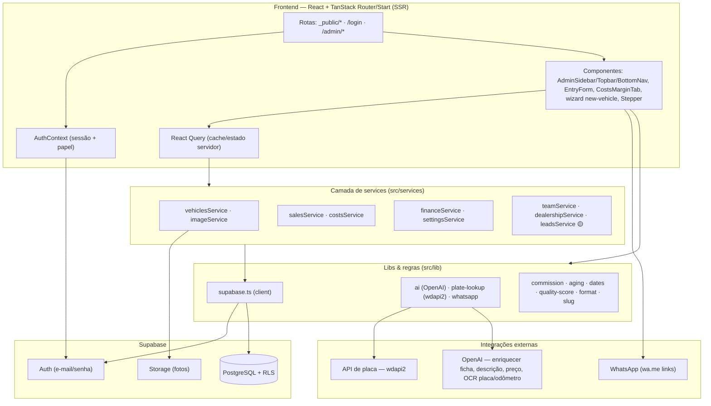
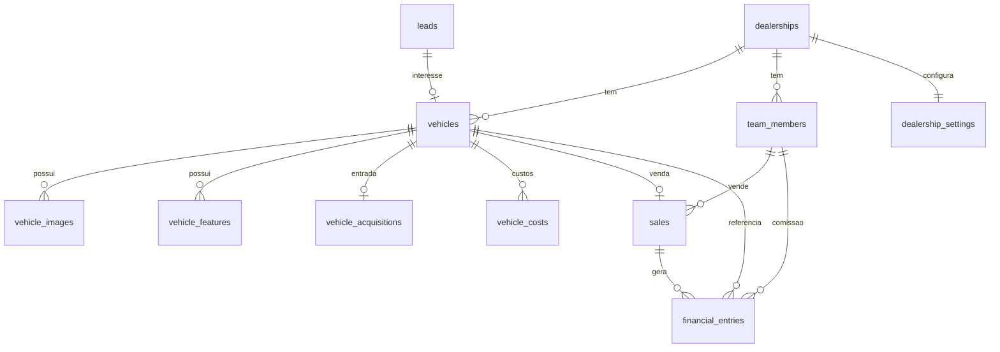

# Fluxograma do Projeto — Atomo Car

Documentação visual de como o sistema funciona de ponta a ponta, gerada a partir da leitura do código (rotas, páginas, componentes, services, tipos e banco).

**Legenda usada nos diagramas**
- 🟢 **Existe** — implementado e funcionando.
- 🟡 **Parcial / mock** — existe na interface mas com dados simulados ou sem integração real.
- 🔵 **Planejado / futuro** — previsto na arquitetura, ainda não implementado.
- ⚠️ **Ponto a confirmar** — comportamento não 100% claro só pelo código.

> Stack: **React + TypeScript + Vite + TanStack Router/Start (SSR)** · **Supabase** (Auth, PostgreSQL, Storage, RLS) · **Tailwind v4 / shadcn** · **React Query**. Deploy na **Vercel**.

---

## 1. Fluxograma geral do sistema

Visão macro: o sistema tem **dois mundos** que consomem o mesmo banco — o **site público** (vitrine) e o **painel administrativo** (a "Central de Operações"). O painel exige login e tem dois papéis (dono e vendedor). Há ainda duas páginas avulsas de demonstração comercial.

> **Observações**
> - **Leads** 🟡: existe a tabela `leads` e um `leadsService` (mock), mas a área de Leads foi **removida do painel** por enquanto (sem integração de canais). O contato do site é feito por **link de WhatsApp**, não grava lead no banco. ⚠️ *Ponto a confirmar: os formulários de "Contato" e "Venda seu veículo" mostram sucesso mas não parecem persistir no banco.*
> - **/apresentacao** e **/demo-azul** são páginas de demonstração comercial (pitch + site alternativo), fora do fluxo operacional.

---

## 2. Fluxo do dono da loja

Caminho principal do dono ao abrir o painel: ele começa pela **saúde da loja**, resolve o que exige atenção, confere o placar financeiro e age (registrar venda, lançar custo, publicar carro).

> O **dashboard do vendedor** é uma variação desta tela: mostra só o próprio estoque, suas vendas (via view segura `seller_sales`) e comissões — **sem** capital, lucro da loja ou financeiro.

---

## 3. Fluxo de cadastro de veículo

Cadastro guiado em **9 etapas** (`/admin/veiculos/novo`). A placa dispara consulta automática (API nacional) e enriquecimento por **IA**. As fotos hoje são **opcionais** (contam só para a nota de qualidade). Ao concluir, o carro é salvo e — dependendo do status escolhido — vai direto para o site.

> **Preparação vs Publicação são eixos independentes.** O carro nasce em "Aguardando" na tela de **Preparação** (`preparation_status`), e a **publicação no site** é controlada pelo status comercial (`status`/`is_published`). A tela de Preparação tem uma "ponte suave": ao ficar **Pronto**, oferece o botão **Publicar no site**.

---

## 4. Fluxo financeiro

O financeiro gira em torno de **uma tabela** (`financial_entries`) com dois tipos: **a pagar** (payable) e **a receber** (receivable). Cada lançamento pode ser **único**, **recorrente** (valor fixo repetido) ou **parcelado** (um total dividido). O **status** (em aberto / vencido / pago) é **derivado** de `paid_at` e `due_date` — não é uma coluna fixa.

> **Regras confirmadas no código**
> - `getMonthlyCashflow` só conta lançamentos **pagos** (fluxo realizado) → futuros em aberto não distorcem o passado.
> - Excluir uma **série** remove só as parcelas **em aberto** (preserva as já pagas).
> - Comissões e recebimentos de venda **nascem automaticamente** ao registrar uma venda (ver fluxo 5).

---

## 5. Fluxo de venda de veículo

Registrar uma venda (`/admin/vendas/nova` → `salesService.registerSale`) é uma **cadeia**: calcula os números com "fotografia" (snapshot) do momento, cria a venda, **dá baixa no estoque** (some do site) e gera automaticamente o recebimento e a comissão. Tudo é **reversível** (desfazer venda).

> **Lucro real (KPI do dashboard)** = venda − aquisição − custos − comissão (`net_profit`, coluna gerada no banco). A **margem prevista** (carro no pátio) = preço anunciado − investido.

---

## 6. Arquitetura técnica simplificada

Camadas: **UI (rotas/páginas/componentes)** → **camada de services** → **Supabase**. Regra do projeto: componentes **não** falam com o banco direto — sempre via `services/`. Segredos (token de placa, chave de IA) rodam em **server functions** do TanStack Start.

### Entidades de dados (tabelas principais)

> **RLS (segurança no banco):** dados sensíveis (custos, aquisição, vendas, financeiro) são **owner-only**. O vendedor vê o estoque e as próprias vendas por uma **view segura** (`seller_sales`), sem custo/lucro — o bloqueio é no banco, não só na tela.

---

## A) Resumo da arquitetura atual

- **Frontend** React + TypeScript + Vite, com **TanStack Router/Start** (roteamento por arquivo e SSR). Rotas divididas em **site público** (`_public.*`), **login** e **painel** (`admin.*`).
- **Estado servidor** com **React Query**; **contexto de auth** carrega sessão e papel (dono/vendedor).
- **Camada de services** isola todo acesso ao Supabase (nenhum componente consulta o banco direto). Regras de negócio puras em `src/lib` (comissão, aging, datas, qualidade).
- **Backend Supabase**: PostgreSQL com **RLS por papel**, Auth por e-mail/senha e Storage para fotos. Migrations versionadas em `docs/sql/001…009`.
- **Server functions** (TanStack Start) guardam segredos e chamam **APIs externas**: consulta de placa (wdapi2) e **OpenAI** (enriquecer ficha, gerar descrição/preço, OCR de placa e odômetro).
- **Deploy** na Vercel.

## B) Principais fluxos do sistema

1. **Cadastro de veículo** guiado (9 etapas) com placa → API + IA, fotos opcionais, custos e publicação.
2. **Venda** com cálculo de lucro/comissão, baixa automática do estoque e geração de recebimento/comissão (reversível).
3. **Financeiro** com contas a pagar/receber, lançamentos únicos, recorrentes e parcelados; status derivado; fluxo de caixa.
4. **Dashboard do dono** ("Central de Operações"): saúde da loja, atenção hoje, capital parado, previsão de caixa.
5. **Papéis**: dono vê tudo; vendedor tem visão restrita, garantida por RLS.

## C) Pontos confusos encontrados no código

- **Leads** 🟡: tabela + `leadsService` existem, mas a área foi removida do painel e o service é **mock**. ⚠️ Formulários públicos (Contato, Venda seu veículo) mostram sucesso mas **não gravam** lead — confirmar intenção.
- **Marketing** 🟡: "Publicações" é mock (sem integração real com redes/portais); "Conteúdo IA" gera texto mas **não publica**.
- **`pseudoChannels`** na listagem de estoque exibe canais de publicação **fictícios** (cosmético) — pode confundir quem lê o dado como real.
- **Validação do wizard**: o avançar é travado por etapa; a conclusão final checa só a etapa de Revisão. Como cada etapa já foi validada para avançar, funciona — mas a lógica de "validar tudo só no fim" fica implícita.
- **Snapshot vs. atual**: a venda guarda snapshots de custo/aquisição; se um custo for lançado **depois** da venda, ele não entra no lucro registrado (correto, mas não sinalizado na tela).
- Alguns arquivos ainda misturam **tokens de marca** (bg-carbon, text-clean) com utilitários de cor — já foi feito um sweep no wizard, mas vale padronizar no restante do painel.

## D) Sugestões de melhorias na organização do projeto

1. **Agrupar por feature** (ex.: `features/vehicles`, `features/finance`, `features/sales`) reunindo rota + componentes + service, em vez de espalhar por `routes/`, `components/`, `services/`.
2. **Remover ou marcar claramente os mocks** (leads, publicações, pseudoChannels) para não passarem por dados reais numa demo.
3. **Centralizar as chaves de query** do React Query (hoje strings soltas como `["sales"]`, `["admin","vehicles"]`) num único módulo para evitar cache dessincronizado.
4. **Extrair um hook `useVehiclesFinance`** (junta vehicles + acquisitions + costs + sales) já usado em 3 telas com a mesma derivação.
5. **Documentar o modelo de status** (comercial vs. preparação) num README curto — é a fonte de confusão mais provável para quem entra no projeto.
6. **Tema claro**: concluir o sweep de cores (padronizar tokens semânticos) no restante do painel além do wizard.

## E) Próximos fluxogramas que deveriam ser criados futuramente

- **Fluxo de papéis e permissões (RLS)** — o que cada papel enxerga/bloqueia, com a view `seller_sales`.
- **Ciclo de vida do veículo** (máquina de estados): rascunho → aguardando fotos → ativo → reservado → vendido / inativo, cruzado com preparação (none → em preparação → pronto).
- **Fluxo de recorrência/parcelamento** detalhado (geração das ocorrências, edição/exclusão de série).
- **Integração com IA** (placa → enriquecimento → conteúdo → preço) como diagrama de sequência.
- **Fluxo de leads/atendimento** — quando as integrações de canais (WhatsApp/Instagram) forem implementadas.
- **Pipeline de publicação/marketing** — quando houver publicação real em portais/redes.

---

_Documento gerado a partir da leitura do código atual. Nada de código funcional foi alterado._
